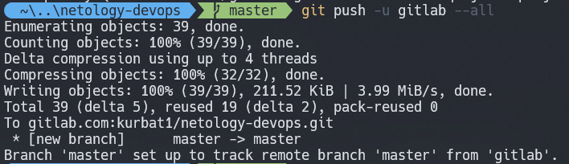

# Домашнее задание к занятию «2.2. Основы Git»

## Домашнее задание к занятию «2.2. Основы Git»

Подключаемся к Bitbucket и Gitlab

При выводе команды remote получаем: 
Пушим в Bitbucket: 

При пуше в gitlab получил ошибки и пришлось создать ключ.

Генерация shh-key для gitlab: 

Пушим в Gitlab: 

Чтобы посмотреть мои проекты добавил ссылки:

[My Bitbucket project](https://bitbucket.org/kurbat1/netology-devops/src/master/)

[My Gitlab project](https://gitlab.com/kurbat1/netology-devops/-/tree/master)

## Задание №2 – Теги

Добавил тег v0.0.1-rc и запушил его во все удаленные репозитории. 

## Задание №3 – Ветки

После изменения в git log --oneline --graph --all: 