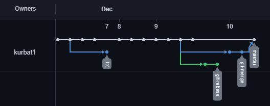
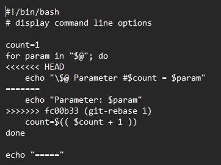
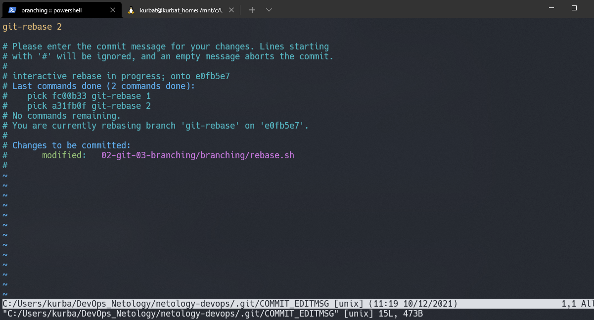
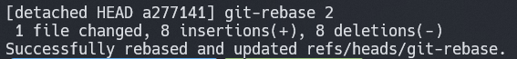
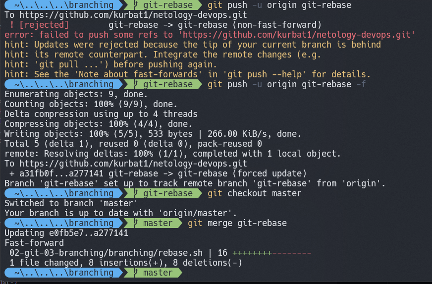

# Домашнее задание к занятию «2.3. Ветвления в Git»


## Подготовка к выполнению задания

---

Создаем каталоги `mkdir 02-git-03-branching\branching` и два файла merge.sh и rebase.sh идентичного содержания:


```bash
#!/bin/bash
# display command line options
  
   count=1
   for param in "$*"; do
       echo "\$* Parameter #$count = $param"
       count=$(( $count + 1 ))
   done
   
   
```

```
cp .\merge.sh .\rebase.sh
```
Сделаем предварительный коммит в ветку master:
`git commit -m 'prepare for merge and rebase'`


## Подготовка файла *merge.sh*:

---

Создадим ветку git-merge:
```
$ git switch -c git-merge
  Switched to a new branch 'git-merge'
```
Заменим содержимое файла *merge.sh* на:
```bash
#!/bin/bash
  # display command line options
  
  count=1
  for param in "$@"; do
      echo "\$@ Parameter #$count = $param"
      count=$(( $count + 1 ))
  done
```
Сделаем коммит и отправим изменения в репозиторий *git-merge*:
```
$ git add .
$ git commit -m 'merge: @ instead *'
$ git push -u origin git-merge
```
Внесем еще одно изменение в *merge.sh*:
```bash
#!/bin/bash
  # display command line options
  
  count=1
  while [[ -n "$1" ]]; do
      echo "Parameter #$count = $1"
      count=$(( $count + 1 ))
      shift
  done
```
Сделаем коммит и отправим изменения в репозиторий git-merge:
```
$ git commit -a -m 'merge: use shift'
$ git push 
```
## Изменение ветки *master*

---
Вернемся в ветку *master*:
```
$ git checkout master
Switched to branch 'master'
Your branch is up to date with 'origin/master'.
```
Изменим файл *rebase.sh* и отправим изменения в репозиторий *master*:
```bash
  #!/bin/bash
  # display command line options
  
  count=1
  for param in "$@"; do
      echo "\$@ Parameter #$count = $param"
      count=$(( $count + 1 ))
  done
  
  echo "====="
```
```
$ git add .
$ git commit -m 'rebase.sh to main'
$ git push -u origin main
```
## Подготовка файла *rebase.sh*

---
Найдем хэш коммита 'prepare for merge and rebase' и сделаем checkout на него:
```
$git checkout d410805
Note: switching to 'd410805'.

You are in 'detached HEAD' state. You can look around, make experimental
changes and commit them, and you can discard any commits you make in this
state without impacting any branches by switching back to a branch.

If you want to create a new branch to retain commits you create, you may
do so (now or later) by using -c with the switch command. Example:

  git switch -c <new-branch-name>

Or undo this operation with:

  git switch -

Turn off this advice by setting config variable advice.detachedHead to false

HEAD is now at d410805 prepare for merge and rebase
```
Создадим на этом коммите ветку *git-rebase*:
`$ git switch -c git-rebase`

Заменим строку `echo "Parameter: $param"` на `echo "Next parameter: $param"` и сделаем еще один коммит в *git-rebase*:
```
$ git commit -a -m 'git-rebase 2'
$ git push
```
## Merge

---
Сливаем ветку *git-merge* с веткой *master*
```
$git merge git-merge
Merge made by the 'recursive' strategy.
02-git-03-branching/branching/merge.sh | 5 +++--
1 file changed, 3 insertions(+), 2 deletions(-)
```
Итог на вкладке *Insights -> Network graph* :



## Rebase

---
Выполним rebase ветки *git-rebase* на *master*:
```
$git rebase master
error: could not apply fc00b33... git-rebase 1
Resolve all conflicts manually, mark them as resolved with
"git add/rm <conflicted_files>", then run "git rebase --continue".
You can instead skip this commit: run "git rebase --skip".
To abort and get back to the state before "git rebase", run "git rebase --abort".
Could not apply fc00b33... git-rebase 1
Auto-merging 02-git-03-branching/branching/rebase.sh
CONFLICT (content): Merge conflict in 02-git-03-branching/branching/rebase.sh
```


После решения конфлика



получаем 



Если попытаться запушить на удаленны репозиторий, то получим ошибку:
```
$git push
To https://github.com/kurbat1/netology-devops.git
 ! [rejected]        git-rebase -> git-rebase (non-fast-forward)
error: failed to push some refs to 'https://github.com/kurbat1/netology-devops.git'
hint: Updates were rejected because the tip of your current branch is behind
hint: its remote counterpart. Integrate the remote changes (e.g.
hint: 'git pull ...') before pushing again.
hint: See the 'Note about fast-forwards' in 'git push --help' for details.
```
С флагом `force` все пушится нормально: 
```
$git push -u origin git-rebase -f
Enumerating objects: 9, done.
Counting objects: 100% (9/9), done.
Delta compression using up to 4 threads
Compressing objects: 100% (4/4), done.
Writing objects: 100% (5/5), 533 bytes | 266.00 KiB/s, done.
Total 5 (delta 1), reused 0 (delta 0), pack-reused 0
remote: Resolving deltas: 100% (1/1), completed with 1 local object.
To https://github.com/kurbat1/netology-devops.git
 + a31fb0f...a277141 git-rebase -> git-rebase (forced update)
Branch 'git-rebase' set up to track remote branch 'git-rebase' from 'origin'.
```
После мёрджим без проблем:
```
$git merge git-rebase
Updating e0fb5e7..a277141
Fast-forward
 02-git-03-branching/branching/rebase.sh | 16 ++++++++--------
 1 file changed, 8 insertions(+), 8 deletions(-)
```


На этом этапе все конфликты решены.
