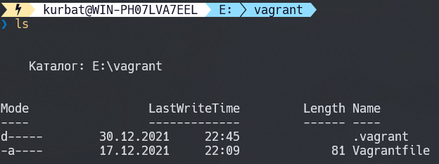
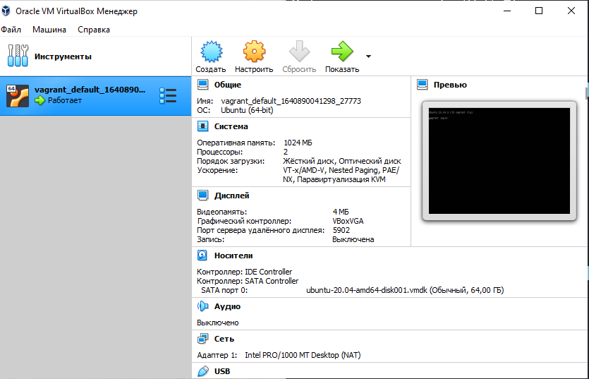
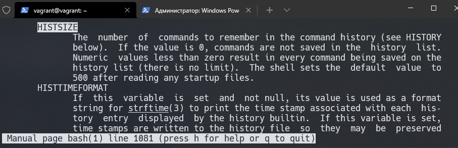
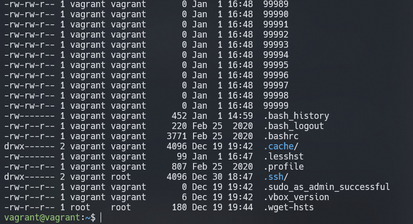

# Домашнее задание к занятию "3.1. Работа в терминале, лекция 1"

---


С помощью базового файла конфигурации запустите Ubuntu 20.04 в VirtualBox посредством Vagrant:



Вставляем код в *Vagrantfile*:
```bash
Vagrant.configure("2") do |config|
 	config.vm.box = "bento/ubuntu-20.04"
 end
```
После запускаем `vagrant up` для установки и запуска виртуальной машины.
Vagrant по-умолчанию создал виртуальную машину с:

- двумя виртуальными процессорами
- 1 Гб ОЗУ
- 64 Гб HDD
- одним сетевым интерфейсом, подключенным к публичной сети, с редиректом 127:0.0.1:2222
на порт 22 интерфейса виртуальной машины
- пользователем vagrant/vagrant с аутентификацией по открытому ключу.





Согласно документации, следующие строки в Vagrantfile добавляют ОЗУ и виртуальных процессоров виртуальной машине:
```bash
config.vm.provider "virtualbox" do |v|
  v.memory = 1024
  v.cpus = 2
end
```
---
- Какой переменной можно задать длину журнала `history`, и на какой строчке manual это описывается?



- что делает директива `ignoreboth` в bash?

`ignoreboth` - с помощью этого аргумента в history  не будут запоминаться команды, начинающиеся на пробел (`ignorespace`)
и которые уже есть в истории команд (`ignoredups`)

- В каких сценариях использования применимы скобки `{}` и на какой строчке `man bash` это описано?

Про { list } написано с 238 строки мануала.
В данном случае, выполняется список команд (list) в уже запущенной оболочке с установленными на текущий момент переменными окружения.
Результатом будет exitcode последней команды из списка команд.

- С учётом ответа на предыдущий вопрос, как создать однократным вызовом `touch` 100000 файлов? Получится ли аналогичным образом создать 300000? Если нет, то почему?




При создании 300000 получаем сообщение 
```
-bash: /usr/bin/touch: Argument list too long
```
Не успех связан с превышением максимальной длины массива символов ARG_MAX, предназначенным для хранения аргументов программы, запускаемой на выполнение посредством системного вызова execve(2)


- В man bash поищите по `/\[\[`. Что делает конструкция `[[ -d /tmp ]]`

Выражение `[[ -d /tmp ]]` проверяет на существование каталог /tmp

- Основываясь на знаниях о просмотре текущих (например, PATH) и установке новых переменных; командах, которые мы рассматривали, добейтесь в выводе type -a bash в виртуальной машине наличия первым пунктом в списке:
```
bash is /tmp/new_path_directory/bash
bash is /usr/local/bin/bash
bash is /bin/bash
```
Исходное состояние:
```bash
vagrant@vagrant:~$ type -a bash
bash is /usr/bin/bash
bash is /bin/bash
```
Команды:
```bash
vagrant@vagrant:~$ mkdir /tmp/new_path_directory
vagrant@vagrant:~$ ln -s /usr/bin/bash /tmp/new_path_directory/bash
vagrant@vagrant:~$ export PATH="/tmp/new_path_directory/:$PATH"
```
Вывод:
```bash
vagrant@vagrant:~$ type -a bash
bash is /tmp/new_path_directory/bash
bash is /usr/bin/bash
bash is /bin/bash
```
- Чем отличается планирование команд с помощью `batch` и `at`?

`at` - запускает команду (или пакет команд) в жёстко заданное время

`batch` - запускает команду (или пакет команд) во время, когда загрузка процессора упала ниже предопределённого значения
(load average), например: запустить команду, когда уровень средней загрузки системы будет ниже 0.1)