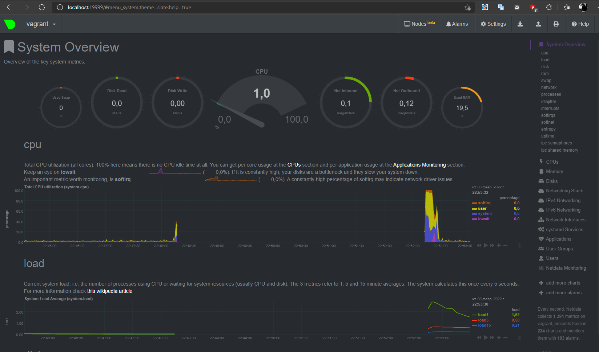
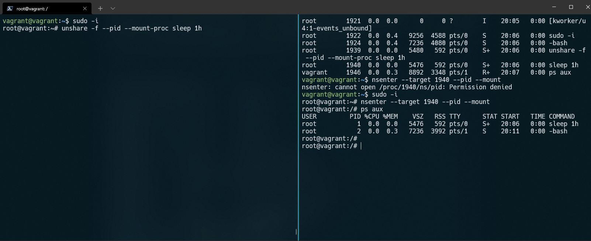

# Домашнее задание к занятию "3.4. Операционные системы, лекция 2"

1. На лекции мы познакомились с [node_exporter](https://github.com/prometheus/node_exporter/releases).
В демонстрации его исполняемый файл запускался в background. Этого достаточно для демо,
но не для настоящей production-системы, где процессы должны находиться под внешним управлением.
Используя знания из лекции по systemd, создайте самостоятельно простой
[unit-файл](https://www.freedesktop.org/software/systemd/man/systemd.service.html) для node_exporter:

    * поместите его в автозагрузку,
    * предусмотрите возможность добавления опций к запускаемому процессу через внешний файл (посмотрите, например, на `systemctl cat cron`),
    * удостоверьтесь, что с помощью systemctl процесс корректно стартует, завершается, а после перезагрузки автоматически поднимается.

---
```bash
vagrant@vagrant:~$ wget https://github.com/prometheus/node_exporter/releases/download/v1.3.1/node_exporter-1.3.1.linux-amd64.tar.gz
vagrant@vagrant:~$ tar xvfz node_exporter-1.3.1.linux-amd64.tar.gz
root@vagrant:~# mv node_exporter-1.3.1.linux-amd64 /opt/node_exporter

```

Создал файл `nano /etc/systemd/node_exporter.service` c содержимым:
```bash
[Unit]

Description=Node exporter

Documentation=https://github.com/prometheus/node_exporter

[Install]

WantedBy=multi-user.target

[Service]

ExecStart=/opt/node_exporter/node_exporter
```
```bash
root@vagrant:~# systemctl enable node_exporter
root@vagrant:~# systemctl status node_exporter
● node_exporter.service - Node exporter
     Loaded: loaded (/etc/systemd/system/node_exporter.service; disabled; vendo>
     Active: active (running) since Thu 2022-01-27 17:34:32 UTC; 31s ago
       Docs: https://github.com/prometheus/node_exporter
   Main PID: 1221 (node_exporter)
      Tasks: 4 (limit: 1071)
     Memory: 2.4M
     CGroup: /system.slice/node_exporter.service
             └─1221 /opt/node_exporter/node_exporter

Jan 27 17:34:32 vagrant node_exporter[1221]: ts=2022-01-27T17:34:32.899Z caller>
Jan 27 17:34:32 vagrant node_exporter[1221]: ts=2022-01-27T17:34:32.899Z caller>
Jan 27 17:34:32 vagrant node_exporter[1221]: ts=2022-01-27T17:34:32.899Z caller>
Jan 27 17:34:32 vagrant node_exporter[1221]: ts=2022-01-27T17:34:32.899Z caller>
Jan 27 17:34:32 vagrant node_exporter[1221]: ts=2022-01-27T17:34:32.899Z caller>
Jan 27 17:34:32 vagrant node_exporter[1221]: ts=2022-01-27T17:34:32.899Z caller>
Jan 27 17:34:32 vagrant node_exporter[1221]: ts=2022-01-27T17:34:32.899Z caller>
Jan 27 17:34:32 vagrant node_exporter[1221]: ts=2022-01-27T17:34:32.899Z caller>
Jan 27 17:34:32 vagrant node_exporter[1221]: ts=2022-01-27T17:34:32.899Z caller>
Jan 27 17:34:32 vagrant node_exporter[1221]: ts=2022-01-27T17:34:32.900Z caller>
lines 1-20/20 (END)
```
2. Ознакомьтесь с опциями node_exporter и выводом `/metrics` по-умолчанию. Приведите несколько опций,
которые вы бы выбрали для базового мониторинга хоста по CPU, памяти, диску и сети.

---
```bash
vagrant@vagrant:~$ curl http://localhost:9100/metrics | egrep ^node_
```
```bash
CPU:
    node_cpu_seconds_total{cpu="0",mode="idle"} 541.58
    node_cpu_seconds_total{cpu="0",mode="system"} 10.44
    node_cpu_seconds_total{cpu="0",mode="user"} 7.35
    process_cpu_seconds_total
    
Memory:
    node_memory_MemAvailable_bytes 7.30382336e+08
    node_memory_MemFree_bytes 2.37490176e+08
    
Disk:
    node_disk_io_time_seconds_total{device="sda"}  15.688
    node_disk_read_bytes_total{device="sda"} 5.15176448e+08
    node_disk_read_time_seconds_total{device="sda"} 9.773
    node_disk_write_time_seconds_total{device="sda"} 1.93
    
Network:
    node_network_receive_errs_total{device="eth0"} 0
    node_network_receive_bytes_total{device="eth0"} 91150
    node_network_transmit_bytes_total{device="eth0"} 96289
    node_network_transmit_errs_total{device="eth0"} 0
```

3. Установите в свою виртуальную машину [Netdata](https://github.com/netdata/netdata). Воспользуйтесь
[готовыми пакетами](https://packagecloud.io/netdata/netdata/install) для установки (`sudo apt install -y netdata`).
После успешной установки:
    * в конфигурационном файле `/etc/netdata/netdata.conf` в секции [web] замените значение с localhost
   на `bind to = 0.0.0.0`,
    * добавьте в Vagrantfile проброс порта Netdata на свой локальный компьютер и сделайте `vagrant reload`:

    ```bash
    config.vm.network "forwarded_port", guest: 19999, host: 19999
    ```

    После успешной перезагрузки в браузере *на своем ПК* (не в виртуальной машине) вы должны суметь зайти
на `localhost:19999`. Ознакомьтесь с метриками, которые по умолчанию собираются Netdata и с комментариями,
которые даны к этим метрикам.

---



5. Можно ли по выводу `dmesg` понять, осознает ли ОС, что загружена не на настоящем оборудовании,
а на системе виртуализации?

---
Да
```bash
vagrant@vagrant:~$ dmesg | grep virtual
[    0.004852] CPU MTRRs all blank - virtualized system.
[    0.171499] Booting paravirtualized kernel on KVM
[    3.899547] systemd[1]: Detected virtualization oracle.
```
5. Как настроен sysctl `fs.nr_open` на системе по-умолчанию? Узнайте, что означает этот параметр.
Какой другой существующий лимит не позволит достичь такого числа (`ulimit --help`)?

---
Максимальное количество открытых файлов для процесса также регулируется builtin ulimit: "мягкий" лимит,
максимальное разрешенное количество открытых файлов процессу:
```bash
vagrant@vagrant:~$ sysctl fs.nr_open
fs.nr_open = 1048576
vagrant@vagrant:~$ ulimit -Sn #Soft
1024
vagrant@vagrant:~$ ulimit -Hn #Hard
1048576
```

6. Запустите любой долгоживущий процесс (не `ls`, который отработает мгновенно, а, например, `sleep 1h`)
в отдельном неймспейсе процессов; покажите, что ваш процесс работает под PID 1 через `nsenter`.
Для простоты работайте в данном задании под root (`sudo -i`). Под обычным пользователем требуются дополнительные
опции (`--map-root-user`) и т.д.

---

7. Найдите информацию о том, что такое `:(){ :|:& };:`. Запустите эту команду в своей виртуальной машине Vagrant
с Ubuntu 20.04 (**это важно, поведение в других ОС не проверялось**). Некоторое время все будет "плохо",
после чего (минуты) – ОС должна стабилизироваться. Вызов `dmesg` расскажет, какой механизм помог автоматической
стабилизации. Как настроен этот механизм по-умолчанию, и как изменить число процессов, которое можно создать
в сессии?

---
`:(){ :|:& };:` Определяет функцию с именем `:` , которая порождает саму себя. Таким образом, каждый экземпляр `:`
начинает два новых `:` и так далее... Можно предотвратить такие атаки,
используя `ulimit` для ограничения количества `processes-per-user`:` $ ulimit -u 50`
 
