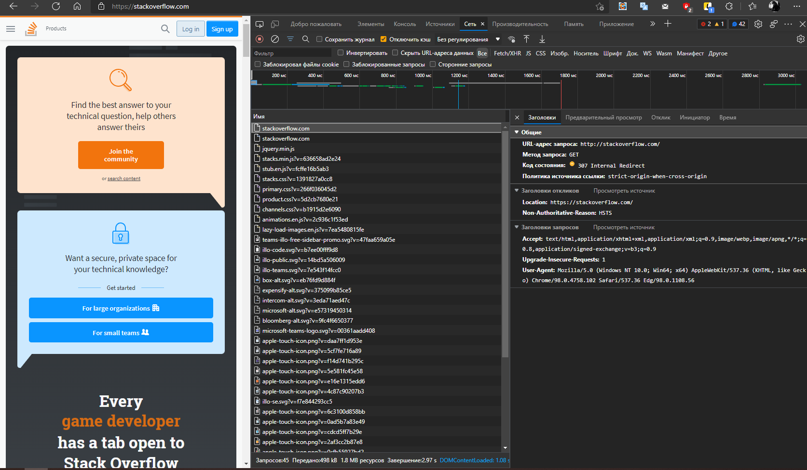
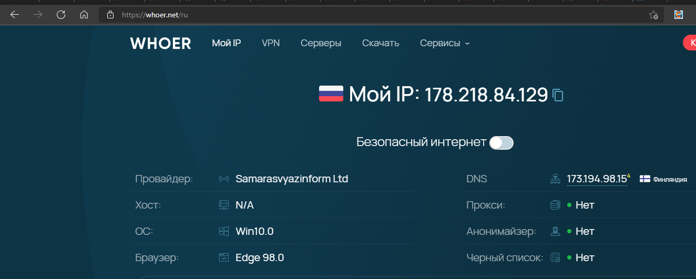
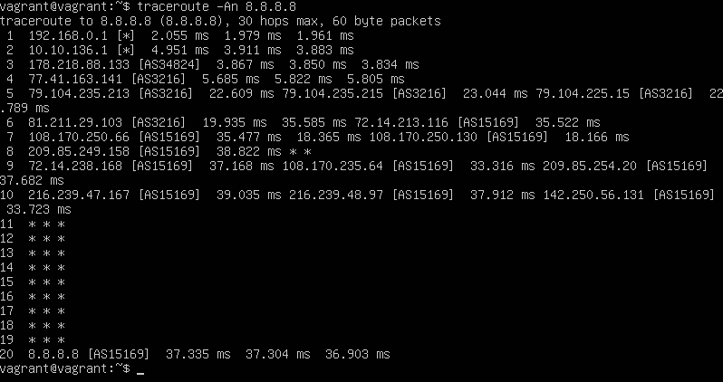
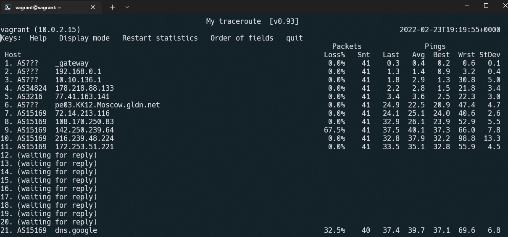

# Домашнее задание к занятию "3.6. Компьютерные сети, лекция 1"

1. *Работа c HTTP через телнет.*
- *Подключитесь утилитой телнет к сайту stackoverflow.com*
`telnet stackoverflow.com 80`
- *отправьте HTTP запрос*
```bash
GET /questions HTTP/1.0
HOST: stackoverflow.com
[press enter]
[press enter]
```
- *В ответе укажите полученный HTTP код, что он означает?*
- --
```bash
vagrant@vagrant:~$ telnet stackoverflow.com 80
Trying 151.101.129.69...
Connected to stackoverflow.com.
Escape character is '^]'.
GET /questions HTTP/1.0
HOST: stackoverflow.com

HTTP/1.1 301 Moved Permanently
cache-control: no-cache, no-store, must-revalidate
location: https://stackoverflow.com/questions
x-request-guid: 26ac32fc-e25c-47a4-ba0c-076c443ed3d7
feature-policy: microphone 'none'; speaker 'none'
content-security-policy: upgrade-insecure-requests; frame-ancestors 'self' https://stackexchange.com
Accept-Ranges: bytes
Date: Wed, 23 Feb 2022 17:44:52 GMT
Via: 1.1 varnish
Connection: close
X-Served-By: cache-bma1664-BMA
X-Cache: MISS
X-Cache-Hits: 0
X-Timer: S1645638293.856738,VS0,VE101
Vary: Fastly-SSL
X-DNS-Prefetch-Control: off
Set-Cookie: prov=f849e910-ceac-8ba9-c601-d88afb38ed8d; domain=.stackoverflow.com; expires=Fri, 01-Jan-2055 00:00:00 GMT; path=/; HttpOnly

Connection closed by foreign host.
```
`301 Moved Permanently` запрошенный документ был на постоянной основе перенесен на новый URI,
указанный в поле Location заголовка, в нашем случае: https://stackoverflow.com/questions

2. *Повторите задание 1 в браузере, используя консоль разработчика F12.*
- откройте вкладку `Network`
- отправьте запрос http://stackoverflow.com
- найдите первый ответ HTTP сервера, откройте вкладку `Headers`
- укажите в ответе полученный HTTP код.
- проверьте время загрузки страницы, какой запрос обрабатывался дольше всего?
- приложите скриншот консоли браузера в ответ.
---
- Код ответа: `307 Internal Redirect`
- Страница грузилась: 1.65 сек
- Дольше всего, 416 mc, обрабатывался запрос: `GET https://stackoverflow.com/`

3. *Какой IP адрес у вас в интернете?*

---

4. *Какому провайдеру принадлежит ваш IP адрес? Какой автономной системе AS? Воспользуйтесь утилитой `whois`*

---
```bash
vagrant@vagrant:~$ whois -h whois.radb.net 178.218.84.129
route:          178.218.84.0/24
origin:         AS34824
mnt-by:         MNT-SAMARASVYAZINFORM-CJSC
created:        2016-05-17T09:28:11Z
last-modified:  2016-05-17T09:28:11Z
source:         RIPE
remarks:        ****************************
remarks:        * THIS OBJECT IS MODIFIED
remarks:        * Please note that all data that is generally regarded as personal
remarks:        * data has been removed from this object.
remarks:        * To view the original object, please query the RIPE Database at:
remarks:        * http://www.ripe.net/whois
remarks:        ****************************
```
5. *Через какие сети проходит пакет, отправленный с вашего компьютера на адрес 8.8.8.8? Через какие AS? Воспользуйтесь утилитой `traceroute`*
---


6. *Повторите задание 5 в утилите `mtr`. На каком участке наибольшая задержка - delay?*
---


7. *Какие DNS сервера отвечают за доменное имя dns.google? Какие A записи?*
*воспользуйтесь утилитой `dig`*
---
```bash
vagrant@vagrant:~$ dig -t ns dns.google

; <<>> DiG 9.16.1-Ubuntu <<>> -t ns dns.google
;; global options: +cmd
;; Got answer:
;; ->>HEADER<<- opcode: QUERY, status: NOERROR, id: 14010
;; flags: qr rd ra; QUERY: 1, ANSWER: 4, AUTHORITY: 0, ADDITIONAL: 1

;; OPT PSEUDOSECTION:
; EDNS: version: 0, flags:; udp: 65494
;; QUESTION SECTION:
;dns.google.                    IN      NS

;; ANSWER SECTION:
dns.google.             21089   IN      NS      ns4.zdns.google.
dns.google.             21089   IN      NS      ns3.zdns.google.
dns.google.             21089   IN      NS      ns1.zdns.google.
dns.google.             21089   IN      NS      ns2.zdns.google.

;; Query time: 36 msec
;; SERVER: 127.0.0.53#53(127.0.0.53)
;; WHEN: Wed Feb 23 19:23:04 UTC 2022
;; MSG SIZE  rcvd: 116


```
```bash
vagrant@vagrant:~$ dig dns.google

; <<>> DiG 9.16.1-Ubuntu <<>> dns.google
;; global options: +cmd
;; Got answer:
;; ->>HEADER<<- opcode: QUERY, status: NOERROR, id: 382
;; flags: qr rd ra; QUERY: 1, ANSWER: 2, AUTHORITY: 0, ADDITIONAL: 1

;; OPT PSEUDOSECTION:
; EDNS: version: 0, flags:; udp: 65494
;; QUESTION SECTION:
;dns.google.                    IN      A

;; ANSWER SECTION:
dns.google.             808     IN      A       8.8.8.8
dns.google.             808     IN      A       8.8.4.4

;; Query time: 36 msec
;; SERVER: 127.0.0.53#53(127.0.0.53)
;; WHEN: Wed Feb 23 19:24:13 UTC 2022
;; MSG SIZE  rcvd: 71
```

8. *Проверьте PTR записи для IP адресов из задания 7. Какое доменное имя привязано к IP? воспользуйтесь утилитой `dig`*
---
```bash
vagrant@vagrant:~$ dig -x 8.8.8.8

; <<>> DiG 9.16.1-Ubuntu <<>> -x 8.8.8.8
;; global options: +cmd
;; Got answer:
;; ->>HEADER<<- opcode: QUERY, status: NOERROR, id: 14497
;; flags: qr rd ra; QUERY: 1, ANSWER: 1, AUTHORITY: 0, ADDITIONAL: 1

;; OPT PSEUDOSECTION:
; EDNS: version: 0, flags:; udp: 65494
;; QUESTION SECTION:
;8.8.8.8.in-addr.arpa.          IN      PTR

;; ANSWER SECTION:
8.8.8.8.in-addr.arpa.   6685    IN      PTR     dns.google.

;; Query time: 0 msec
;; SERVER: 127.0.0.53#53(127.0.0.53)
;; WHEN: Wed Feb 23 19:26:44 UTC 2022
;; MSG SIZE  rcvd: 73
```
```bash
vagrant@vagrant:~$ dig -x 8.8.4.4

; <<>> DiG 9.16.1-Ubuntu <<>> -x 8.8.4.4
;; global options: +cmd
;; Got answer:
;; ->>HEADER<<- opcode: QUERY, status: NOERROR, id: 38140
;; flags: qr rd ra; QUERY: 1, ANSWER: 1, AUTHORITY: 0, ADDITIONAL: 1

;; OPT PSEUDOSECTION:
; EDNS: version: 0, flags:; udp: 65494
;; QUESTION SECTION:
;4.4.8.8.in-addr.arpa.          IN      PTR

;; ANSWER SECTION:
4.4.8.8.in-addr.arpa.   12243   IN      PTR     dns.google.

;; Query time: 40 msec
;; SERVER: 127.0.0.53#53(127.0.0.53)
;; WHEN: Wed Feb 23 19:27:57 UTC 2022
;; MSG SIZE  rcvd: 73
```
