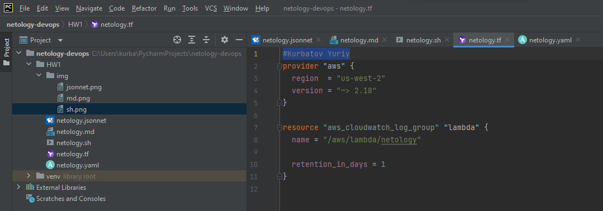
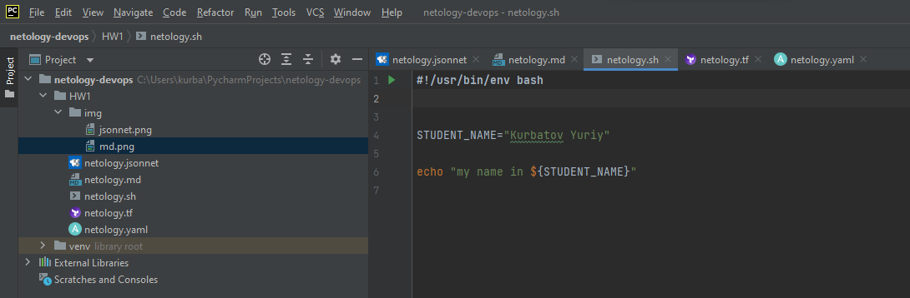
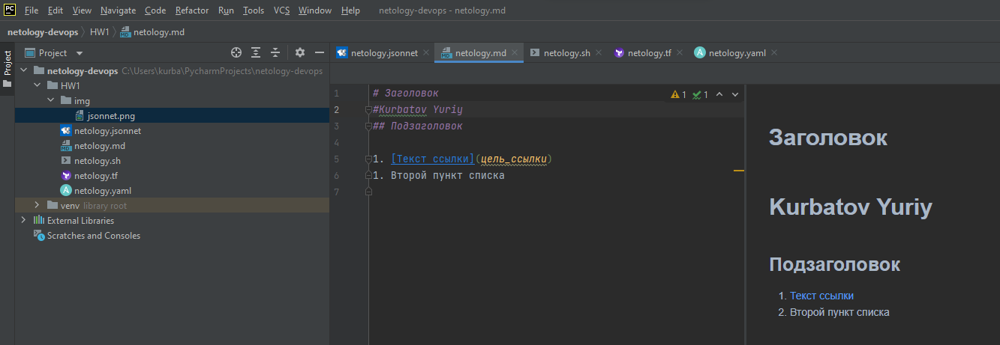
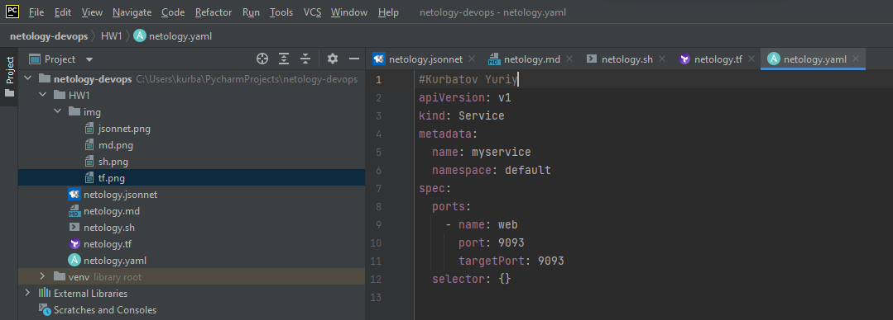
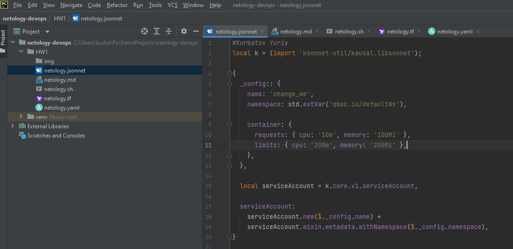

# Домашнее задание к занятию «1.1. Введение в DevOps»

## Задание №1 - Подготовка рабочей среды

Terraform: 
Bash: 
Markdown: 
Yaml: 
Jsonnet: 

## Задание №2 - Описание жизненного цикла задачи (разработки нового функционала)

Чтобы лучше понимать предназначение дальнейших инструментов, с которыми нам предстоит работать, давайте 
составим схему жизненного цикла задачи в идеальном для вас случае.

### Описание истории

Представьте, что вы работаете в стартапе, который запустил интернет-магазин. Ваш интернет-магазин достаточно успешно
развивался, и вот пришло время налаживать процессы: у вас стало больше конечных клиентов, менеджеров и разработчиков.
Сейчас от клиентов вам приходят задачи, связанные с разработкой нового функционала. Задач много, и все они требуют
выкладки на тестовые среды, одобрения тестировщика, проверке менеджером перед показом клиенту. В случае необходимости,
вам будет необходим откат изменений. 

### Решение задачи

Вам необходимо описать процесс решения задачи в соответствии с жизненным циклом разработки программного обеспечения.
Использование какого-либо конкретного метода разработки необязательно. Для решения главное - прописать по пунктам шаги
решения задачи (реализации в конечный результат) с участием менеджера, разработчика (или команды разработчиков),
тестировщика (или команды тестировщиков) и себя как DevOps-инженера. 

************************
###Описание со стороны devops+разработка:

1. Определиться со стеком и архитектурой. Понять на текущий момент масштабируем ли проект или нет
2. Ввести систему контроля версий для параллельной разработки(git, svn).
3. Необходимо настроить одинаковое окружение на всех стендах(Dev, Test, Prod).
4. Так же было неплохо настроить репозиторий для хранения кода(TeamCity, BitBucket) и менеджера репозиториев для авто
перекладывания кода(типа Nexus).
5. Поднять какой-нибудь тасктреккер(типа Jira).
6. Тестировщикам необходимо писать автотесты, чтобы ускорить тестирование.
7. По мере роста команды необходимо вводить автоматическую проверку качества кода(типа Sonar).

###Если смотреть со стороны менеджера+аналитика:

1. Определить основного заказчика(В тексте написано, что "Сейчас от клиентов....")
2. Контроль внедрения Таскменеджера.
3. Приоритизация задач, обозначение дедлайнов.
4. Определение критериев приемки.
